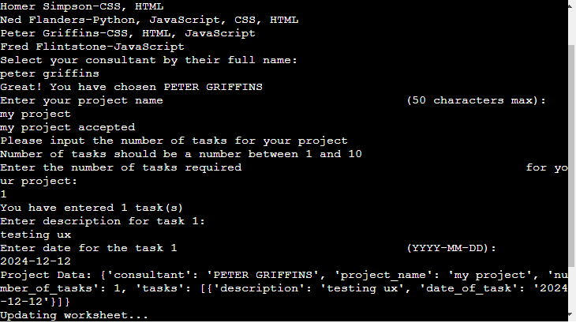

# Task Scheduler
An application for scheduling project activities created as part of project submission to Code Institute for the Diploma in Full Stack Software Development (E-commerce applications).

The application can be viewed on the Code Institute mock terminal on [Heroku](https://task-scheduler-v1-ff610b0f7ba4.herokuapp.com/)

## Contents
- [User Experience](#user-experience)
    - [Initial Discussion](#initial-discussion)
    - [User Stories](#user-stories)
        - [First Time Visitor Goals](#first-time-visitor-goals)
        - [Returning Visitor Goals](#returning-visitor-goals)
        - [Frequent Visitor Goals](#frequent-visitor-goals)
    - [Design](#design)
        - [Flow Chart](#flow-chart)
- [Features](#features)
- [Technologies Used](#technologies-used)
    - [Languagues](#languages)
    - [Frameworks](#frameworks)
- [Testing](#testing)
    - [PEP8 Python Validator](#pep8-python-validator)
        - [Python](#python)
    - [Manual](#manual)
    - [Testing User Stories from User Experience (UX) Section](#testing-user-stories-from-user-experience-ux-section)
        - [First Time Visitor Goals](#first-time-visitor-goals-1)
        - [Returning Visitor Goals](#returning-visitor-goals-1)
        - [Frequent Visitor Goals](#frequent-visitor-goals-1)
    - [Bugs](#bugs)
      - [Known](#known)
      - [Fixed](#fixed)
- [Deployment & Local Development](#deployment-local-development)
    - [Deployment](#deployment)
    - [Local Development](#local-development)
- [Credits](#credits)
    - [Code Used](#code-used)
    - [Resources](#resources)
    - [Acknowledgments](#acknowledgments)

## User Experience
### Initial Discussion
The idea of creating a basic task scheduler made sense to me as I work as a Project Manager. We use tools to assist with creating schedules, however for small value projects they're over the top and are time consuming to create a simple project/task schedule.
### User Stories
#### First Time Visitor Goals
- I want clear instructions to follow through the user journey
- I want to know what data to enter and when a wrong value is entered
- I want the text to be laid out clearly
- I want to know when my inputs are accepted
- I want to be able to choose from a list of consultants
- I want to be able to input project name
- I want to be able to input task descriptions
- I want to be able to input date for task completion
- I want to be able to see when my inputs are copied across to google docs

#### Returning Visitor Goals
- I want to be able to add another project when I'm finished with my entry

#### Frequent Visitor Goals
- I want to be able to edit my entries(future implementation)
- I want to be able to edit weekly/monthly schedules(future implementation)

### Design
The flow of the application is simple and easy to follow. The default black background and white text are used. Appropriate spacing is present throughout to ensure that the content readable. Some artwork is used throughout to welcome users and highlight when data is accepted. The terminal is cleared when an error shows up to improve readability.

#### Flow Chart
1. Initial Chart

2. Mid Point Chart

3. Final Chart

#### ASCII Art
text

## Features
- The program begins with a welcome message in ASCII art at the top of the terminal. Followed by the menu options prompting the user to make a choice.

- Number 1 Introduction. This section explains to the user how the program works and outlines the steps

- Number 2 Start a new project. This is the main program, users are prompted for consultant choice, project name, number of tasks, task description and dates.
    - Consultant Choice - users are provided with a list of consultants to choose from and are prompted to input their full name.

    
    - Project Name - users are prompted to input the name of the project with maximum of 50 characters.

    
    - Number of Tasks - users are prompted to input the number of tasks within their project. Range of tasks is 1 to 10.

    
    - Task Description - users are prompted to input the description for each task

    
    - Task Date - users are prompted to input the date for each task

    
    - Project Info - when all inputs are entered, project data is then printed in the terminal to show what has been entered

    
    - Google Docs - Entries are then added to google docs
    
    

- Number 3 View Consultant list - users can see the list of consultants and their skills that they wish to use for their projects.

- Number 4 View Projects - users can see the list of current projects added.

- Number 5 Exit - users can exit the program.

## Technologies Used
### Languages
- Python
### Frameworks
- GitHub
    - Used to store code
- GitPod
    - Used for version control by utilising the GitPod terminal to commit to GitHub
- Heroku
    - Used to deploy application
- [PEP8](https://pep8ci.herokuapp.com/)
    - Used to test the code for errors
- [ASCII](https://patorjk.com/software/taag/#p=display&f=Graffiti&t=Type%20Something%20)
    - Website based text to ASCII art generator

## Testing
### PEP8 Python Validator
#### Python
- All clear no errors found

### Manual
- All input fields have been tested manually
    - Consultant Choice
    
    - Project Name
    
    - Number of Tasks
    
    - Task Description
    
    - Task Date
    

### Testing User Stories from User Experience (UX) Section
#### First Time Visitor Goals
- I want clear instructions to follow through the user journey
    - Each user input section has a description on what the user needs to input including characters, number of characters and date format

- I want to know what data to enter and when a wrong value is entered
    - Data validation is present across all manual input fields

- I want the text to be laid out clearly

- I want to know when my inputs are accepted
    - Inputs display acceptance messaging

- I want to be able to choose from a list of consultants

- I want to be able to input project name

- I want to be able to input task descriptions

- I want to be able to input date for task completion

- I want to be able to see when my inputs are copied across to google docs

#### Returning Visitor Goals
- I want to be able to add another project when I'm finished with my entry

#### Frequent Visitor Goals
- Features to be implemented in future development releases

### Bugs
#### Known
- task_input - does not print # of tasks requested. Instead it prints "Number of tasks should be a number between 1 and 10"

- Clear terminal does not function correctly after error

#### Fixed
- date_input - date request was before adding in # of tasks required, had to remove the original function and re add it into get_task_information function

- SyntaxWarning: invalid escape sequence '\ '
  prog_start = """ - Fixed by adding raw string prefix

- SyntaxWarning: invalid escape sequence '\s'
  if re.match("^[a-zA-Z\s\.,'\"-]+$", project_name_input): - Fixed by adding raw string prefix

- SyntaxWarning: invalid escape sequence '\s'
  if re.match("^[a-zA-Z\s\.,'\"-]+$", get_task_information): - Fixed by adding raw string prefix

## Deployment & Local Development
### Deployment
The site was deployed to Heroku and the following steps were followed to do so:
1. Log in to heroku.com, click "New" and then “Create new app”.
2. Give the application a name, choose your region, and Click "Create app".
3. On the next page, within the "Settings" tab, click on the “Reveal Config Vars” button. In the "KEY" input box type PORT and the
"VALUE" input box type 8000. Then click on the "Add" button.
4. Next, click on the “Add buildpack” button. Select “python” and click “Save changes”. Repeat this process to add “nodejs”. It is
important to add them in this order, with Python on top and NodeJS underneath. If they are the other way around you can click and drag
to change the order.
6. When this step is complete select the “Deploy” tab at the top of the page.
7. In the deployment method section, you can connect with GitHub by selecting “GitHub”.
8. In the "connect to GitHub" section type the [repository](https://github.com/AurelijusJarasius/task-scheduler) name in, click “Search”,
and once located click “Connect”.
9. You can choose to deploy using either the automatic or manual option.
10. For automatic deploys select “main” for the “Choose a branch to deploy” option. Click “Enable Automatic Deploys” if desired. This
can be changed at a later date if needed.
11. To manually deploy select “main” for the “Choose a branch to deploy” option. Click “Deploy Branch”. A message appears saying
“Your app was successfully deployed” and a “View” button can be clicked to view the application on a new page.

### Local Development
The steps below describe how to fork or clone the repository if desired.
#### How to Fork
1. Log in to GitHub.
2. Navigate to the [repository](https://github.com/AurelijusJarasius/task-scheduler) for this website.
3. Click the "Fork" button in the top right corner.
4. You will be brought to a new page with a short form to be completed.
5. Upon completing, click on the "Create fork" button and this will create a fork of the repository in your personal account.

#### How to Clone
1. Log in to GitHub.
2. Navigate to the [repository](https://github.com/AurelijusJarasius/task-scheduler) for this website.
3. Click on the "Code" button and a modal will appear.
4. Within this modal select the "local" tab.
5. Within this tab, there are "HTTPS", "SSH", or "GitHub CLI" tabs.
6. Click on the "HTTPS" tab and copy the link shown.
7. In your development environment open the terminal.
8. Change the current working directory to the location where you want the cloned directory to be.
9. Type "git clone" into the terminal, then paste the URL you copied in step 6.
10. Press **Enter** to create your local clone.

## Credits
### Code Used
- OS Clear - function shared by my mentor Alan

- ChatGPT - update_worksheet code below was used to organise data into separate rows

for task in project_data['tasks']:
        row = [
            project_data['consultant'],
            project_data['project_name'],
            task['date_of_task'],
            task['description']
        ]

### Resources
- re - Regular expression https://docs.python.org/3/library/re.html

- raw string - https://www.digitalocean.com/community/tutorials/python-raw-string 

- multiple rows - https://stackoverflow.com/questions/69489384/joining-multiple-rows-into-comma-separated-strings-by-group-in-python

- clear terminal after error - https://teamtreehouse.com/community/ossystemcls-messing-with-my-loop-loop-is-fine-without-the-clear-screen-command-can-someone-explain

- ASCII Text to art generator - https://patorjk.com/software/taag/#p=display&f=Graffiti&t=Type%20Something%20

- Slack - researching various issues encountered through search functions and threads in slack.

- ChatGPT

- Course content

### Acknowledgments
- My mentor Alan Bushell for always being on point with guidance and support
- Lewis Dillon at Code Institute for advice & guidance during the weekly stand ups
- Tutor support at Code Institute for being quick, efficient and percrise with feedback
